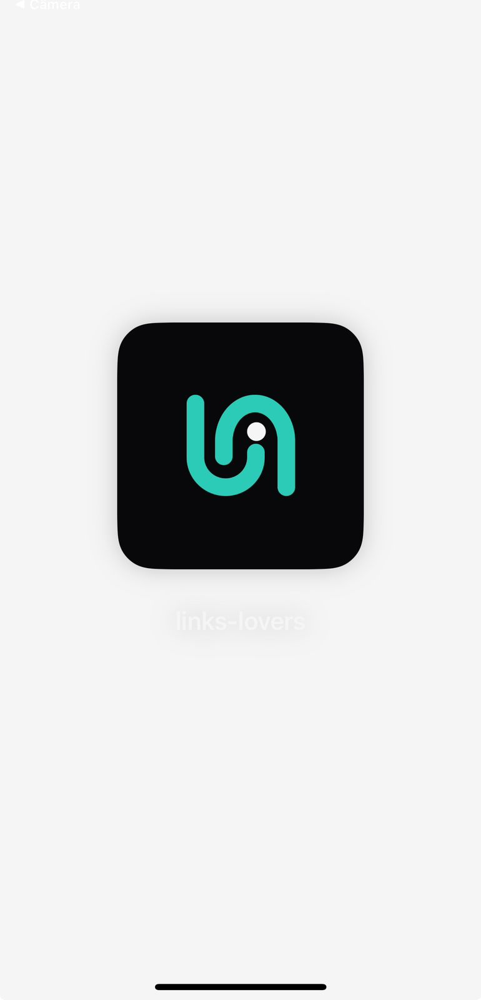
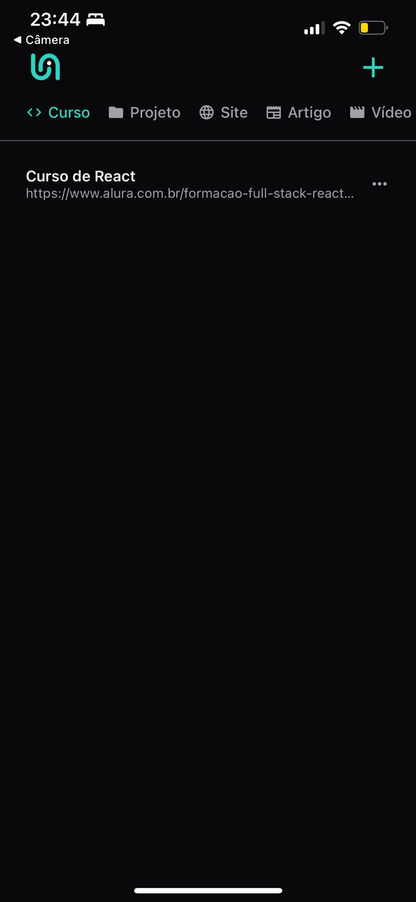
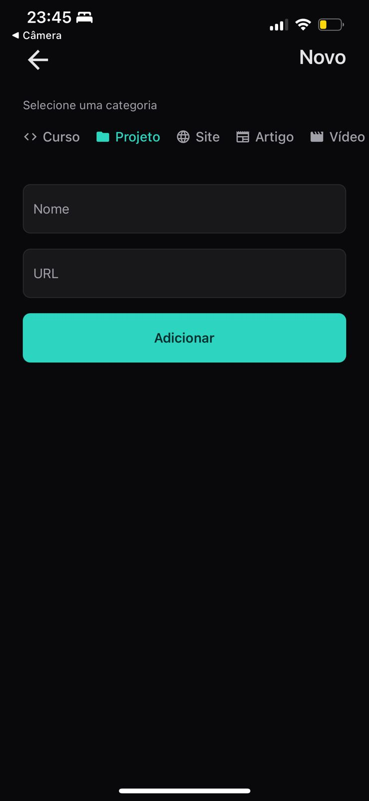

# Links Lovers


Projeto final do curso de React Native (40 aulas). O app organiza links por categoria, com tela de listagem e fluxo de cadastro.

## Sumario

- [Sobre](#sobre)
- [Screenshots](#screenshots)
- [Funcionalidades](#funcionalidades)
- [Stack](#stack)
- [Aprendizados](#aprendizados)
- [Requisitos](#requisitos)
- [Como rodar](#como-rodar)
- [Scripts](#scripts)
- [Estrutura](#estrutura)
- [Licenca](#licenca)

## Sobre

Links Lovers e um app simples para salvar e consultar links favoritos. O foco do projeto foi praticar fundamentos de React Native com Expo, navegacao, componentes reutilizaveis e persistencia local.

## Screenshots

<table>
   <tr>
      <td></td>
      <td></td>
   </tr>
   <tr>
      <td></td>
      <td></td>
   </tr>
</table>

## Funcionalidades

- Cadastro de links com titulo, url e categoria
- Listagem por categoria
- Persistencia local via Async Storage
- Layout responsivo para mobile

## Stack

- React Native + Expo
- TypeScript
- Expo Router
- Async Storage
- ESLint / Prettier (opcional)

## Aprendizados

- Arquitetura de rotas com Expo Router
- Componentizacao e padronizacao visual
- Persistencia local com Async Storage
- Separacao de responsabilidades (componentes, estilos, storage)
- Organizacao de estado e efeitos na tela de listagem

## Requisitos

- Node.js 18+ (ou 20+)
- npm ou yarn
- Expo Go (no celular) ou emulador

## Como rodar

1. Instale as dependencias:

   ```bash
   npm install
   ```

2. Inicie o projeto:

   ```bash
   npm run start
   ```

3. Abra no celular com o Expo Go ou no emulador.

## Scripts

- `npm run start` - inicia o Expo
- `npm run android` - abre no Android
- `npm run ios` - abre no iOS
- `npm run web` - abre no navegador

## Estrutura

```
src/
  app/              # Rotas (Expo Router)
  assets/           # Assets do app
  components/       # Componentes reutilizaveis
  storage/          # Persistencia local
  styles/           # Cores e estilos compartilhados
  utils/            # Constantes e helpers
```

## Licenca

Este projeto e de uso educacional.
